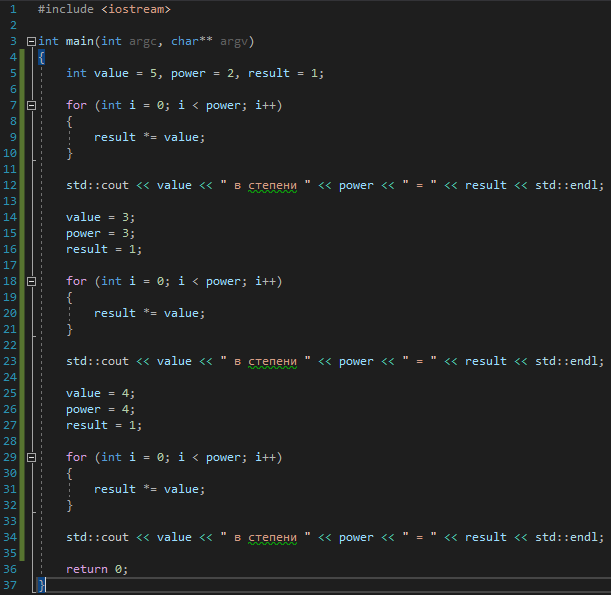

# Задача 2. Устранение дублирования

### Описание
Дана программа:



Определите, что она делает, и найдите дублирующийся код. Создайте функцию, которая будет устранять дублирование, и вместо повторяющегося кода вызывайте её. Результат работы программы не должен измениться.

### Пример работы программы
```
5 в степени 2 = 25
3 в степени 3 = 27
4 в степени 4 = 256
```
